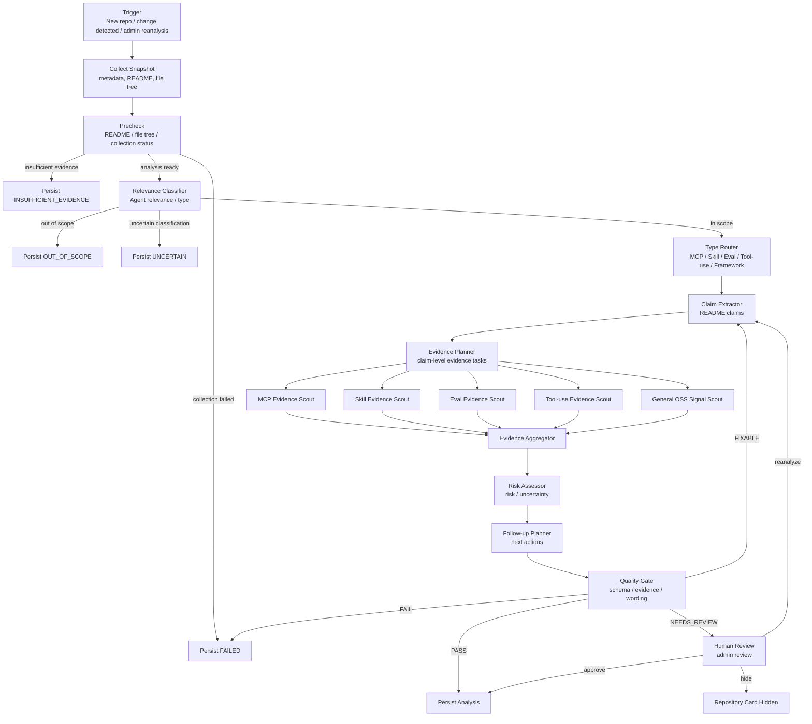
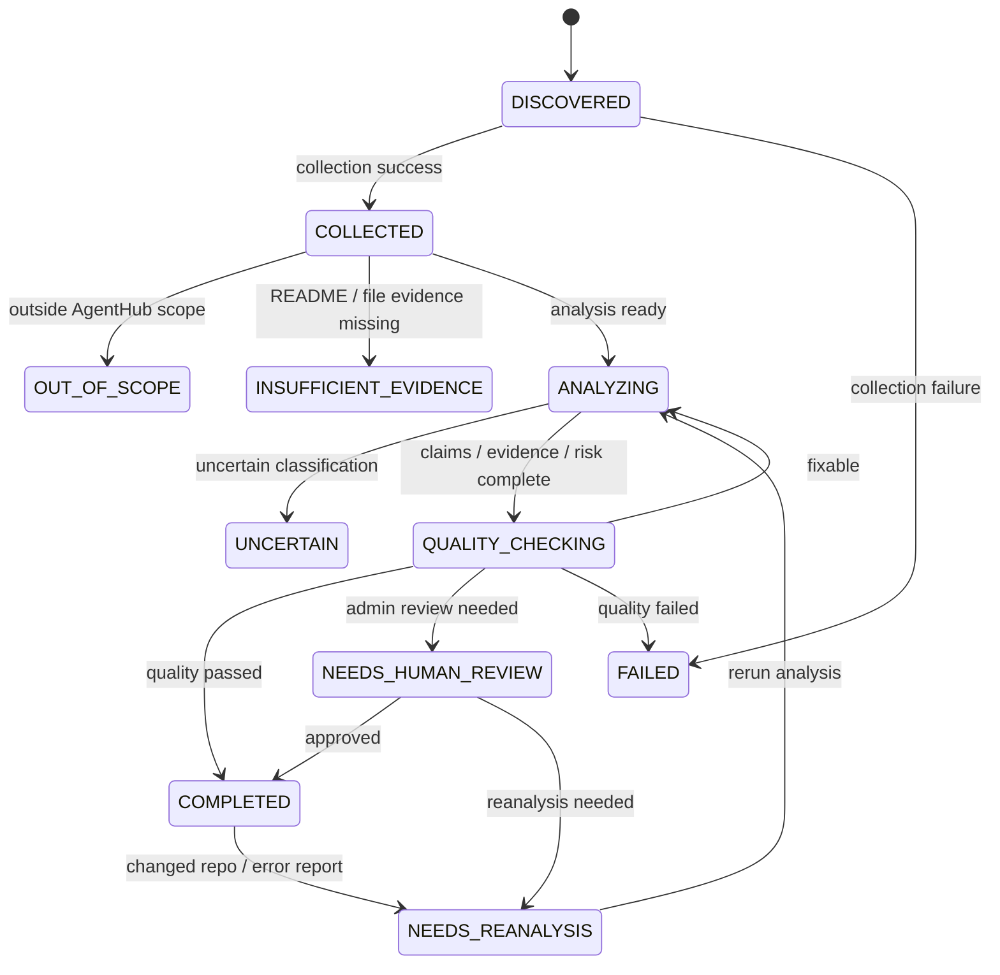
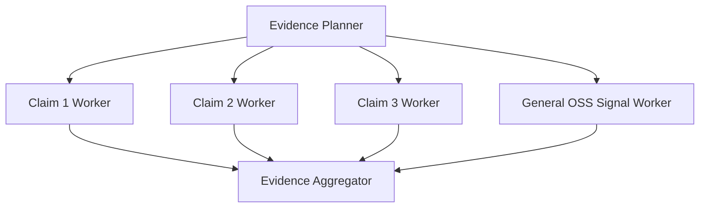
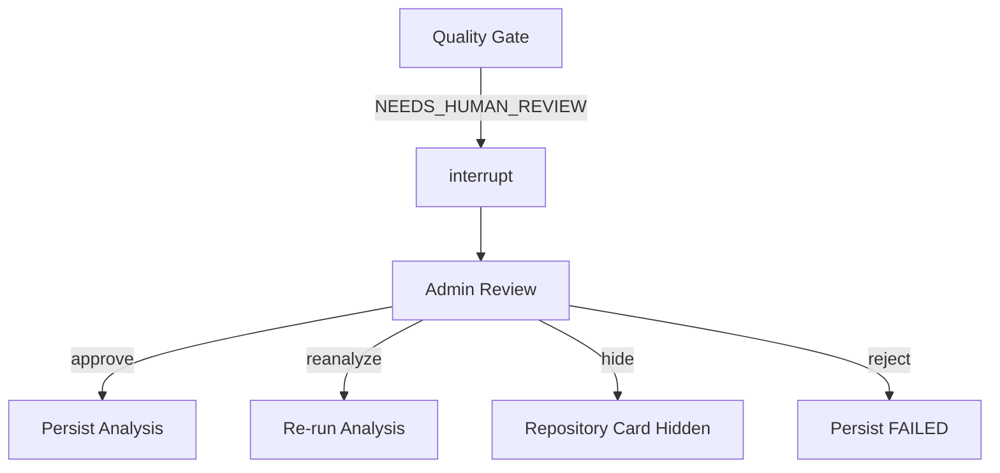
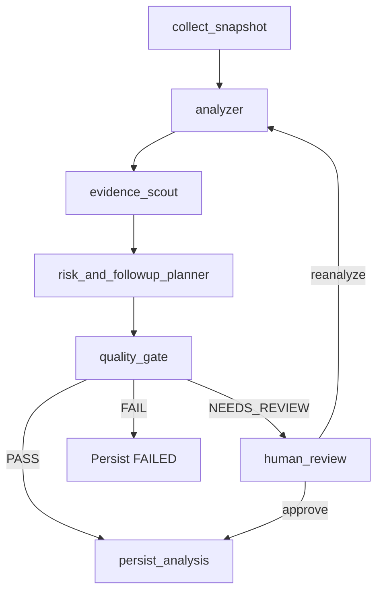

# AgentHub Analysis Agent Workflow

## Purpose

AgentHub analysis agent analyzes GitHub repositories and produces follow-up guidance for AI-agent-related open source projects.

The goal is not to verify, rank, certify, or audit a repository. The goal is to reduce exploration time by showing what a user should inspect first before deciding whether to follow up.

The analysis output should include:

- README claims
- implementation evidence signals
- agent technology type
- risk signals
- follow-up guide
- recommended actions
- analysis status

## Product Fit Review

This workflow fits the intended product goal.

The core problem is that there are too many AI-agent-related open source repositories, and users cannot quickly tell which ones deserve attention or what to inspect first. This workflow addresses that problem by combining static repository signals, README claims, evidence paths, risk labels, and next-action labels.

The workflow is correctly framed as a follow-up decision aid rather than a trust score or repository quality verdict. This distinction matters because the MVP uses static signals only. Static signals can show structure, claims, and inspection targets, but they cannot prove runtime correctness, security, benchmark quality, or maintenance reliability.

The most important design choice is the separation between README claims and repository evidence. That prevents the system from treating marketing language as implementation truth. It also gives the user a concrete path: read the claim, inspect the linked files, then decide whether to run, compare, bookmark, or deprioritize.

## Core Principles

| Principle | Meaning |
| --- | --- |
| Evidence-first | Analysis results should include concrete evidence such as file paths, directories, config files, README sources, tests, examples, or dependency files whenever possible. |
| Claim/Evidence separation | README claims and repository implementation signals must be stored separately. |
| Static-signal MVP | The MVP does not run code, perform security audits, analyze full ASTs, or execute benchmarks. |
| Explicit uncertainty | Missing evidence, uncertain classification, failed analysis, and reanalysis needs must be visible in state and output. |
| Action-oriented output | The output should prioritize next actions and inspection paths over raw scores. |
| Human-in-the-loop | Error reports, admin reanalysis, and quality failures should support human review. |

## Final Workflow



## LangGraph Patterns

| Pattern | Where | Purpose |
| --- | --- | --- |
| Batch Pipeline | Full analysis flow | Store analysis ahead of user exploration instead of doing expensive real-time analysis. |
| Router | After relevance/type classification | Apply different evidence standards for MCP, Skill, Eval, Tool-use, Framework, Observability, and Guardrail repos. |
| Orchestrator-Worker | Evidence search | Split claim-level evidence search into workers. |
| Evidence-first | Claim, Evidence, Risk generation | Prevent unsupported assertions. |
| Evaluator-Optimizer | Quality Gate | Catch missing evidence, schema issues, and overconfident language. |
| Human-in-the-loop | Admin review | Support approval, reanalysis, hiding, and rejection. |
| State Machine | Analysis status | Keep completed, insufficient, failed, uncertain, and reanalysis states explicit. |
| Checkpoint/Persistence | LangGraph execution | Support recovery, replay, and human review continuation. |

## Analysis States



## Node Definitions

| Node | Role | Output |
| --- | --- | --- |
| `collect_snapshot` | Collect GitHub metadata, README, file tree, and high-signal files. | raw snapshot |
| `precheck` | Check whether analysis can proceed. | `COLLECTED`, `FAILED`, `INSUFFICIENT_EVIDENCE` |
| `classify_relevance` | Classify AgentHub relevance and agent technology type. | `agent_type`, `relevance_score`, `classification_reason` |
| `route_by_type` | Select type-specific evidence criteria. | MCP / Skill / Eval / Tool-use / Framework path |
| `extract_claims` | Extract README claims. | `AnalysisClaim[]` |
| `plan_evidence_tasks` | Create claim-level evidence search tasks. | `EvidenceTask[]` |
| `evidence_scout` | Search file, directory, config, example, test, dependency, and doc signals. | `EvidenceSignal[]` |
| `aggregate_evidence` | Merge evidence worker outputs. | unified `EvidenceSignal[]` |
| `assess_risk` | Identify insufficient evidence, maintenance, docs, execution, or uncertainty risk. | `RiskSignal[]` |
| `plan_followup` | Generate user next actions and follow-up route. | `followup_actions`, `followup_guide` |
| `quality_gate` | Validate schema, evidence, state, and wording. | `PASS`, `FIXABLE`, `NEEDS_REVIEW`, `FAIL` |
| `human_review` | Handle admin approve, reanalyze, hide, or reject decisions. | admin decision |
| `persist_analysis` | Store analysis result. | `RepositoryAnalysis` |

## Type Router Criteria

| Type | Main Evidence Signals |
| --- | --- |
| MCP Server | `mcp`, `tools`, `resources`, `prompts`, `server`, `mcp.json`, tool schema |
| MCP Client | server connection, tool discovery, resource access, authorization |
| Skill | `SKILL.md`, skill manifest, instruction file, reusable workflow |
| Eval Harness | `eval/`, `benchmark/`, dataset, scoring logic, runner |
| Tool-use | tool registry, function schema, executor, tool wrapper |
| Agent Framework | planner, memory, tool router, executor, multi-agent orchestration |
| Observability | tracing, logs, spans, eval report, dashboard |
| Guardrail | validation, policy, permission, sandbox, safety filter |

## Evidence Worker Structure



## Quality Gate Criteria

| Check | Failure Condition |
| --- | --- |
| Claim source | Claim has no README source. |
| Evidence path | Evidence has no file or directory path. |
| Claim/Evidence link | Claim has no supporting evidence signal. |
| Risk coverage | Evidence is weak but no risk is recorded. |
| State consistency | Status is `COMPLETED` without evidence. |
| Overconfident wording | Output contains terms such as verified, safe, guaranteed, or perfectly implemented. |
| Schema validity | Result cannot be stored as valid JSON. |

## Human Review Flow



## Output Schema

### RepositoryAnalysis

```json
{
  "repositoryId": "string",
  "status": "COMPLETED | INSUFFICIENT_EVIDENCE | UNCERTAIN | FAILED | NEEDS_REANALYSIS",
  "agentType": "MCP_SERVER | MCP_CLIENT | SKILL | EVAL_HARNESS | TOOL_USE | AGENT_FRAMEWORK | OBSERVABILITY | GUARDRAIL | OTHER | UNKNOWN",
  "readmeSummary": "string",
  "techStackSummary": "string",
  "followUpGuide": [],
  "analyzedAt": "datetime"
}
```

### AnalysisClaim

```json
{
  "claimId": "string",
  "analysisId": "string",
  "claimText": "string",
  "claimType": "string",
  "source": "README.md",
  "confidence": 0.0
}
```

### EvidenceSignal

```json
{
  "evidenceId": "string",
  "analysisId": "string",
  "claimId": "string",
  "signalType": "FILE_PATH | DIRECTORY | CONFIG | EXAMPLE | TEST | DOC | DEPENDENCY | KEYWORD",
  "path": "string",
  "summary": "string",
  "confidence": 0.0
}
```

### RiskSignal

```json
{
  "riskId": "string",
  "analysisId": "string",
  "riskType": "INSUFFICIENT_EVIDENCE | LOW_ACTIVITY | NO_EXAMPLES | NO_TEST_SIGNAL | DEPRECATED | UNCLEAR_LICENSE | ANALYSIS_UNCERTAIN",
  "severity": "LOW | MEDIUM | HIGH",
  "summary": "string"
}
```

### FollowUpAction

```json
{
  "action": "READ_NOW | INSPECT_STRUCTURE | TRY_EXAMPLE | COMPARE | BOOKMARK | READ_WITH_CAUTION | DEPRIORITIZE | NEEDS_REANALYSIS",
  "reason": "string",
  "targetPaths": ["string"]
}
```

## User Action Labels

| Label | Criteria |
| --- | --- |
| `READ_NOW` | High relevance and README claims are connected to implementation evidence. |
| `INSPECT_STRUCTURE` | Important files or directories are visible. |
| `TRY_EXAMPLE` | Quickstart, examples, scripts, or runnable paths are visible. |
| `COMPARE` | Worth comparing with similar repositories. |
| `BOOKMARK` | Worth tracking, but not urgent. |
| `READ_WITH_CAUTION` | Risk or evidence gaps exist. |
| `DEPRIORITIZE` | Low relevance or low follow-up value. |
| `NEEDS_REANALYSIS` | Change detected, error report received, or quality failure occurred. |

## MVP Graph



## Current Prototype Coverage

The current prototype implements the MVP path, not the full final workflow.

Implemented:

- CLI trigger through `agenthub_analysis.cli`
- fixed repository snapshot input
- snapshot normalization
- combined relevance/type classification and README claim extraction in `analyzer`
- single static `evidence_scout`
- combined risk and follow-up planner
- quality gate with evidence and uncertainty checks
- JSON persistence

Not yet implemented:

- live GitHub collector
- separate `precheck` node
- separate `classify_relevance` node
- `route_by_type`
- separate `extract_claims`
- `plan_evidence_tasks`
- type-specific evidence workers
- evidence aggregation node
- separate risk assessor and follow-up planner
- human review interrupt
- DB persistence
- reanalysis history
- human-readable report layer

## Implementation Principles

```text
LLM does not make unsupported final judgments.
LLM structures claims, evidence, risk, and follow-up actions only within the evidence available.
If evidence is weak, store INSUFFICIENT_EVIDENCE or UNCERTAIN instead of COMPLETED.
Show users action labels and inspection paths before scores.
Keep analysis results separate from community signals.
Do not overwrite historical analyses during reanalysis; store new analysis versions.
```
